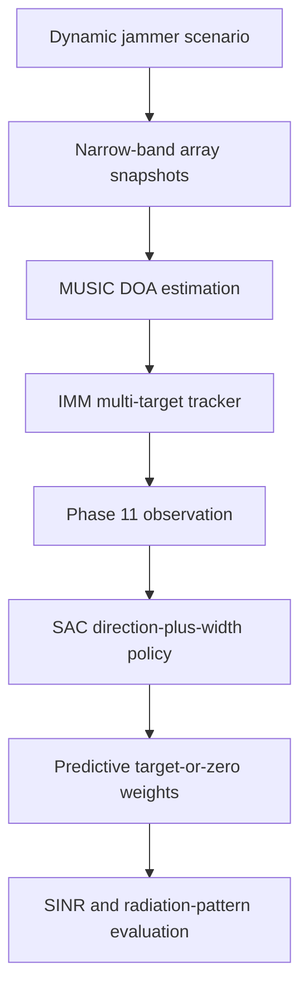

# Cognitive Digital Beamforming for Jammer-Resilient Systems

This repository contains the Python simulation framework developed for the Master's Thesis **Cognitive Digital Beamforming for Jammer-Resilient Systems**. It combines narrow-band array modelling, conventional and adaptive digital beamforming, jammer motion models, MUSIC direction-of-arrival (DOA) estimation, multi-target tracking, and Deep Reinforcement Learning (DRL).

The main entry point for reviewing the complete framework is [`demo.ipynb`](demo.ipynb). It runs one reproducible multi-jammer example with the selected Phase 11 agent:

`phase11_agent_direction_width_K20_mixed_002`

It also explains how to switch safely to retained agents or environment families from the other phases without mixing incompatible state, action, algorithm, or K-step semantics.

## Demonstrated pipeline



The SOI is fixed and known. MUSIC and the Tracker therefore process the jammers only. The Tracker supplies jammer unit vectors and unit-vector velocities to the trained policy. The policy predicts the SOI direction, the jammer directions, and one normalized predictive-null width per jammer. The resulting beamforming weights are held for (K=20) physical policy steps.

The notebook compares the cognitive agent with:

- conventional SOI steering;
- tracker-driven multi-interference nulling;
- tracker-driven MVDR with the same (K=20) update cadence;
- instantaneous Oracle MVDR, recomputed from true jammer DOAs at every simulation sample.

It reports and plots output SINR, SOI-gain loss, jammer leakage, null depth, physical trajectories, MUSIC detections, Tracker outputs, and visible-hemisphere beampatterns. A separate one-step rollout through `BeamformingEnvPhase11` verifies compatibility between the saved SAC model and its original Gymnasium environment.

## Installation

Python 3.10 or later is required.

```bash
git clone https://github.com/rodriperez194/TFM_demo.git
cd TFM_demo

python -m venv .venv
```

Activate the environment:

```bash
# Linux or macOS
source .venv/bin/activate

# Windows PowerShell
.venv\Scripts\Activate.ps1
```

Install the runtime dependencies and the local package:

```bash
python -m pip install --upgrade pip
python -m pip install -r requirements.txt
```

Run the demonstration from the repository root:

```bash
jupyter lab demo.ipynb
```

The notebook can also be opened directly in VS Code after selecting the virtual-environment kernel.

## Selected Phase 11 agent

| Property | Value |
|---|---:|
| Algorithm | SAC |
| Training timesteps | 1,200,000 |
| Policy network | 128 × 128 |
| Array | 6 × 6 URA |
| Carrier frequency | 10 GHz |
| Maximum active jammers | 3 |
| Training jammer counts | 0, 1, 2, 3 |
| Observation | SOI unit vector + per-jammer unit vector, unit-vector rate, and mask |
| Observation dimension | 24 |
| Action | SOI unit vector + per-jammer unit vector and null-width parameter |
| Action dimension | 15 |
| Weight hold | (K=20) steps |
| Policy time step | 1 s |
| Predictive zeros | 3 per active jammer |
| Weight synthesis | `target_or_zero_weights` |

The saved model and its complete metadata are stored in:

```text
simulation/drl_agent/saved_agents/phase_11/direction_width_sac/
├── phase11_agent_direction_width_K20_mixed_002.json
└── phase11_agent_direction_width_K20_mixed_002.zip
```

## Using agents from other phases

Changing the `.zip` path alone is not valid. The model algorithm, environment class, observation, action decoder, jammer distribution, and temporal hold K form one compatibility contract and must be changed together.

The following table lists only retained selections that are explicitly identified by the project metadata or final selection work:

| Phase | Retained checkpoint | Loader | Environment | Observation | Action | K |
|---|---|---|---|---:|---:|---:|
| 1 | `phase_1_agent_0` | TD3 | `BeamformingEnv` + Phase 1 action adapter | 11 | 2 | one step |
| 2 | `phase2_agent_55_5` | SAC | `BeamformingEnv` | 15 | 3 | one step |
| 3 | `phase3_grid_agent_012` | SAC | `BeamformingEnvPhase3` | 15 | 6 | one step |
| 4 | `phase4_agent_finetuned_006` | SAC | `BeamformingEnvPhase4` | 15 | 12 | one step |
| 10 | `phase10_agent_symmetric_real_imag_K1_mixed_011` | PPO | `BeamformingEnvPhase10` | 15 | 36 | 1 |
| 10 | `phase10_agent_symmetric_real_imag_K5_mixed_025` | PPO | `BeamformingEnvPhase10` | 15 | 36 | 5 |
| 10 | `phase10_agent_symmetric_real_imag_K20_mixed_028` | PPO | `BeamformingEnvPhase10` | 15 | 36 | 20 |
| 11 | `phase11_agent_direction_width_K1_mixed_007` | SAC | `BeamformingEnvPhase11` | 24 | 15 | 1 |
| 11 | `phase11_agent_direction_width_K5_mixed_001` | SAC | `BeamformingEnvPhase11` | 24 | 15 | 5 |
| 11 | `phase11_agent_direction_width_K20_mixed_002` | SAC | `BeamformingEnvPhase11` | 24 | 15 | 20 |

The notebook contains an executable catalogue and a loader that checks each saved observation/action shape. The required phase-specific changes are summarized below.

### Static direction-policy phases

- **Phase 1:** construct the 11D normalized-angle state with all jammer slots set to zero. Load with TD3. The saved action is in [-1, 1]^2 and must be mapped to the environment's [0, 1]^2 range with `a_env = 0.5 * (a_agent + 1.0)`. Evaluate one static no-jammer step.
- **Phase 2:** use `BeamformingEnv` with unit-vector observation/action. The 15D state contains the SOI unit vector and zero-filled jammer slots; the 3D action is the steering unit vector. Load with SAC and evaluate one static no-jammer step.
- **Phase 3:** use `BeamformingEnvPhase3` with exactly one static jammer, unit-vector observation/action, MVDR beamforming, and the same-beamforming-mode reference. The 15D observation contains SOI plus one jammer and padding; the 6D action predicts both directions. Load with SAC and let the environment generate MVDR weights.
- **Phase 4:** use `BeamformingEnvPhase4` with unit-vector observation/action, MVDR beamforming, and the mixed [0, 1, 2, 3] jammer distribution. The 15D observation uses direction-plus-mask slots; the 12D action contains one SOI and three jammer unit vectors. It remains a static one-step policy.

### Dynamic weight-control phases

No best checkpoint ID is asserted here for Phases 5–9 because the available project evidence does not identify a final retained selection for those phases. Select a concrete checkpoint from its evaluation results, then treat its adjacent JSON metadata as authoritative.

- **Phase 5 — `BeamformingEnvPhase5`:** reproduce the checkpoint's observation mode, complex-weight mode, K, and jammer distribution. For the 6 × 6 array, the action is 36D for phase-only control or 72D for real/imaginary or magnitude/phase control. The action represents full complex weights for a dynamic K-step block.
- **Phase 6 — module `beamforming_env_phase6`:** the module intentionally exports a class still named `BeamformingEnvPhase5`; import it exactly and optionally alias it locally. Its action is a residual around the SOI-steering base, so the residual type, scale, and K must match metadata. It is not an absolute Phase 5 weight vector.
- **Phase 7 — `BeamformingEnvPhase7`:** reproduce the 11D or 15D geometry observation used for training. A 6 × 6 array uses a 72D direct real/imaginary action. The agent and Target-or-Zero teacher are held at the same K-step cadence.
- **Phase 8 — `BeamformingEnvPhase8`:** preserve the sequential episode state. Its observation is 89D in angular mode or 93D in unit-vector mode: geometry, current normalized complex weights, and six physical-feedback values. Its 72D action is a real/imaginary residual around the fixed steering solution.
- **Phase 9 — `BeamformingEnvPhase9`:** pass actions through the environment's scenario-dependent electromagnetic basis. With J coefficient jammer slots, the action dimension is `2 * (1 + 5J)`; the one-jammer specialist uses 12 real components. These are complex basis coefficients, not array weights or directions.

### K-specific phases

- **Phase 10:** load the matching checkpoint with PPO and instantiate `BeamformingEnvPhase10` with the same K. The 15D observation has SOI/jammer unit vectors and masks but no velocities. The 36D action controls 18 independent complex modulation coefficients, which the environment expands using central 180° array symmetry.
- **Phase 11:** load with SAC, retain the 24D direction-and-velocity observation and 15D direction-plus-width action, and set `weight_hold_steps` to the selected K. The retained K=1 setup uses an episode length of 2 physical steps; the K=5 and K=20 setups use 5 and 20 respectively.

For every phase switch:

1. Read the checkpoint's adjacent JSON metadata.
2. Instantiate the original environment with the same representation and physical parameters.
3. Build the exact state, including every required mask, velocity, current-weight, or feedback field.
4. Load with TD3, SAC, or PPO as recorded and assert the saved observation/action shapes.
5. Use the original environment action decoder; never reinterpret directions, absolute weights, residuals, symmetric coefficients, basis coefficients, or null widths as one another.
6. Match K, policy time step, and episode horizon, then repeat the phase's evaluation protocol before comparing performance.

## Demo configuration

The demonstration reuses the three-jammer definition in `simulation/scenarios/scenario_7.ipynb`: a fixed SOI and Truck, Aircraft, and Dummy jammer trajectories. Explicit seeds are applied to the stochastic motion models for repeatability. Received SOI and jammer powers are 1.0 in linear scale, and noise power is (10^{-3}), matching the Phase 11 agent configuration.

MUSIC uses a 6 × 6 URA, 200 snapshots, a 1° polar grid, and a 2° azimuth grid. It is evaluated every three 0.1 s trajectory samples, giving a 0.3 s Tracker update period. The scenario signature is:

```text
1x_aircraft + 1x_dummy + 1x_truck
```

The repository's validated scenario result selects an IMM tracker with Hungarian association for that signature. The generated `scenario_lookup_table.csv` used in the original scenario notebooks is not currently versioned; consequently, the demo asserts the expected signature and applies the recorded `IMM + Hungarian` pair explicitly instead of fabricating a replacement lookup table.

## Repository structure

```text
TFM/
├── demo.ipynb                         # Complete reproducible demonstration
├── README.md                          # Project and execution guide
├── requirements.txt                   # Python runtime dependencies
├── pyproject.toml                     # Installable tfm package configuration
├── src/tfm/
│   ├── estimation/narrow_band/        # MUSIC DOA estimation and peak extraction
│   ├── math/narrow_band/              # Geometry, steering vectors, metrics, responses
│   ├── physics/narrow_band/           # Array model and beamforming weights
│   ├── rl/envs/                       # Gymnasium beamforming environments
│   ├── scenario/                      # ScenarioGenerator
│   ├── selection/                     # Scenario signatures and tracking selection
│   ├── targets/                       # Static, dummy, truck, drone, aircraft motion
│   ├── tracker/                       # CV, CA, IMM trackers, MTT, association policies
│   ├── utils/                         # Angle, trajectory, and plotting helpers
│   └── visuals/                       # Array visualization helpers
├── simulation/                        # Development, training, and analysis notebooks
└── evaluation/                        # Final evaluation notebooks
```

## Reproducibility and interpretation

- The demo uses deterministic model inference and fixed random seeds.
- All beamformers are rescaled to unit total weight power for the final comparison.
- Angles supplied to beamforming functions are in degrees. Scenario DOAs are stored in radians and converted explicitly.
- Powers are linear unless a quantity is explicitly labelled in dB.
- The complete 20 s ground-truth trajectory is shared by every evaluated beamformer.
- Instantaneous Oracle MVDR has true jammer information and a higher update rate; it is an ideal reference, not a cadence-matched baseline.
- MUSIC is supplied with the known number of jammer sources in this controlled demonstration.
- The displayed results characterize one seeded simulation. Statistical conclusions belong to the repeated-scenario evaluations in the thesis.

## Scope

The distributable source tree implements narrow-band spatial processing and cognitive beamforming. The demo intentionally uses only capabilities present in `src/tfm` and the saved trained agent; it does not add unimplemented hardware effects or range-Doppler processing.
